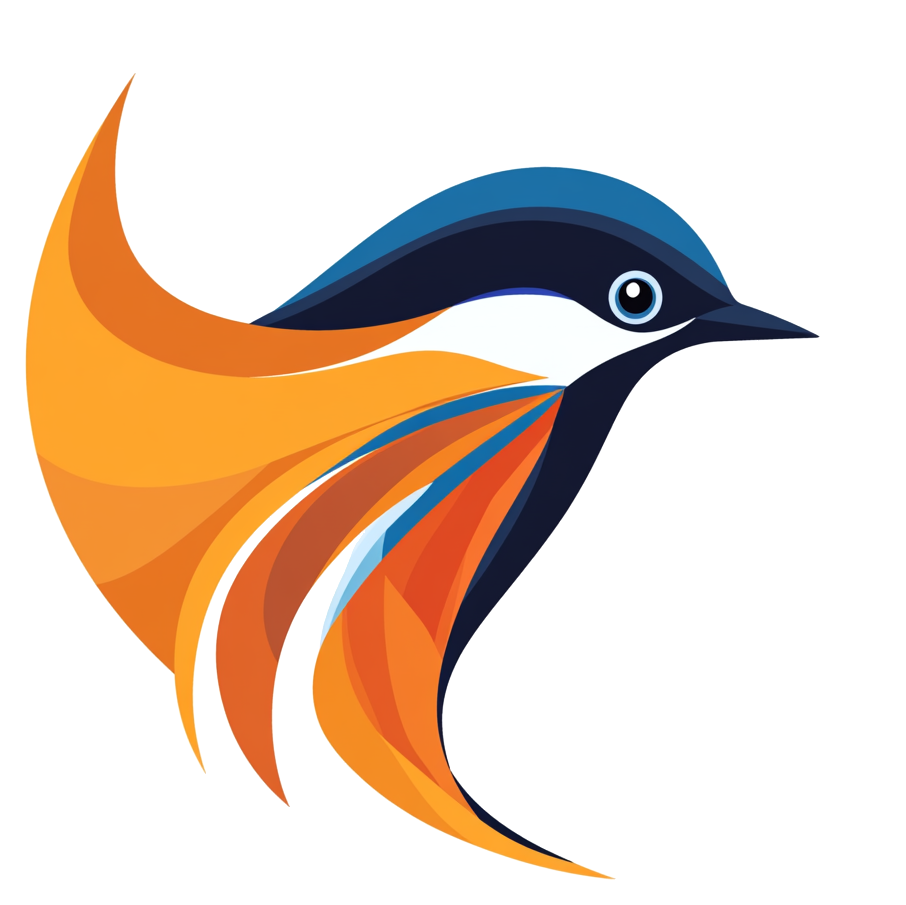

# news-suck

An open-source project for crawling RSS feeds and websites, extracting news content, and storing it with vector embeddings for semantic search.

## Features

- Docker Compose setup for easy local deployment
- Web frontend for managing URLs (RSS feeds and homepages)
- Automated crawler that runs hourly
- Content extraction with title, summary, and timestamps
- Vector embeddings for semantic search using Cohere API
- Duplicate detection with hit-counter tracking
- FAISS-powered vector similarity search for efficient news clustering
- Interactive visualizations:
  - UMAP dimensionality reduction for exploring news relationships
  - Clustered news articles with similarity scores
  - Time-based filtering for both clusters and visualizations

## Architecture

The system consists of four main components:

1. **Web App**: FastAPI backend with Jinja2 templates for the frontend
2. **Crawler Service**: Python service that runs periodically to fetch and process content
3. **Embedding Worker**: Dedicated service for managing vector embeddings and similarity computations
4. **Databases**:
   - PostgreSQL with pgvector extension for news items and metadata
   - FAISS for high-performance vector similarity search and clustering

### Vector Search Architecture

The system uses FAISS (Facebook AI Similarity Search) for efficient vector operations:
- In-memory index for fast similarity searches
- L2 distance-based clustering with cosine similarity
- Automatic index updates for recent news items
- Transitive clustering for finding related news groups

## Getting Started

### Prerequisites

- Docker and Docker Compose
- Cohere API key (for generating embeddings)

### Installation

#### Clone the repository

```bash
git clone https://github.com/cgast/news-suck.git
cd news-suckr
```

#### Create a `.env` file with your Cohere API key

```bash
cp .env.example .env
# Edit .env and add your COHERE_API_KEY
```

#### Start the application

```bash
docker-compose up -d
```

#### Access the web interface at [http://localhost:8000](http://localhost:8000)

### Usage

1. Add URLs to crawl using the web interface
2. The crawler will automatically fetch content from these URLs hourly
3. View and search the collected news items
4. Explore news clusters to find related articles
5. Use the UMAP visualization to discover content relationships

## Development

### Project Structure

```
app/
├── models/          # Database models
├── routes/          # API and web routes
├── services/        # Core services
│   ├── crawler.py   # URL crawling and content extraction
│   ├── embedding_worker.py  # Vector embedding service
│   ├── faiss_service.py    # Vector similarity operations
│   └── visualization.py    # UMAP and clustering visualizations
├── templates/       # Jinja2 HTML templates
└── static/         # CSS, JavaScript, and other static files
```

### Local Development

To run the services individually for development:

#### Set up a virtual environment and install dependencies

```bash
python -m venv venv
source venv/bin/activate  # On Windows: venv\Scripts\activate
pip install -r requirements.txt
```

#### Start the services

```bash
# Start the web app
uvicorn app.main:app --reload

# In another terminal, start the embedding worker
python -m app.services.embedding_worker

# Run the crawler manually when needed
python -m app.crawler_service
```

## Configuration

Configuration options can be set via environment variables:

- `DATABASE_URL`: PostgreSQL connection string
- `COHERE_API_KEY`: API key for Cohere embeddings
- `CRAWLER_INTERVAL`: Interval between crawls in seconds (default: 3600)
- `MAX_CONCURRENT_REQUESTS`: Maximum number of concurrent requests (default: 5)
- `REQUEST_TIMEOUT`: Request timeout in seconds (default: 30)
- `USER_AGENT`: Custom user agent string for the crawler
- `NEWS_RETENTION_DAYS`: Number of days to keep news items (default: 30)
- `NEWS_MAX_ITEMS`: Maximum number of news items to keep (default: 10000)
- `VECTOR_DIMENSIONS`: Dimension of embedding vectors (default: 1024)
- `VISUALIZATION_TIME_RANGE`: Hours of news to include in visualizations (default: 48)
- `VISUALIZATION_SIMILARITY`: Similarity threshold for clustering (default: 0.55)
- `FAISS_UPDATE_INTERVAL`: Interval between FAISS index updates in seconds (default: 3600)
- `FAISS_MAX_VECTORS`: Maximum number of vectors to keep in FAISS index (default: 10000)
- `DEBUG`: Enable debug mode (default: False)
- `ENABLE_URL_MANAGEMENT`: Enable URL management mode, helps to prevent destruction of the demo site (default: True)
- `EMBED_TITLE_ONLY`: Use only the title for generating embeddings instead of title + summary (default: True)

## License

This project is open source and available under the MIT License.

## Contributing

Contributions are welcome! Please feel free to submit a Pull Request.
